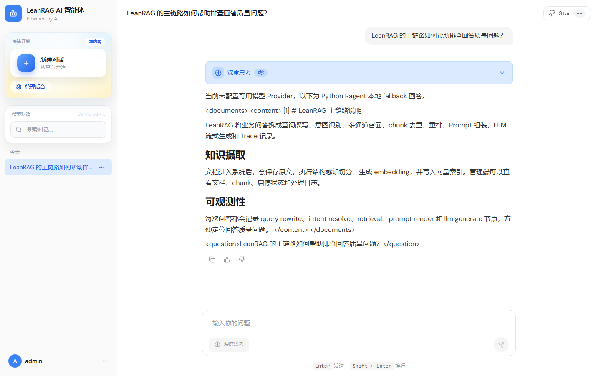
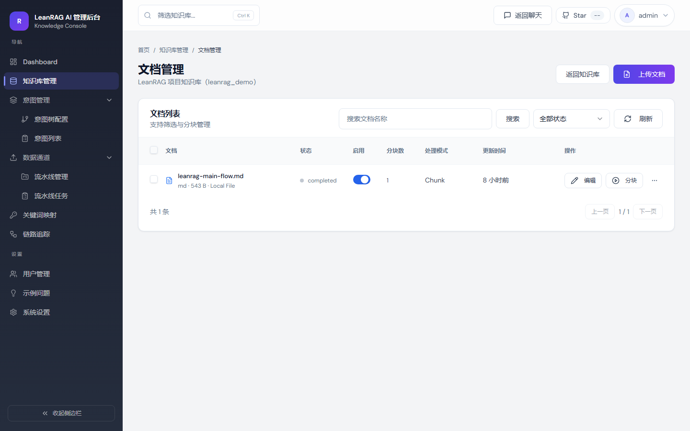
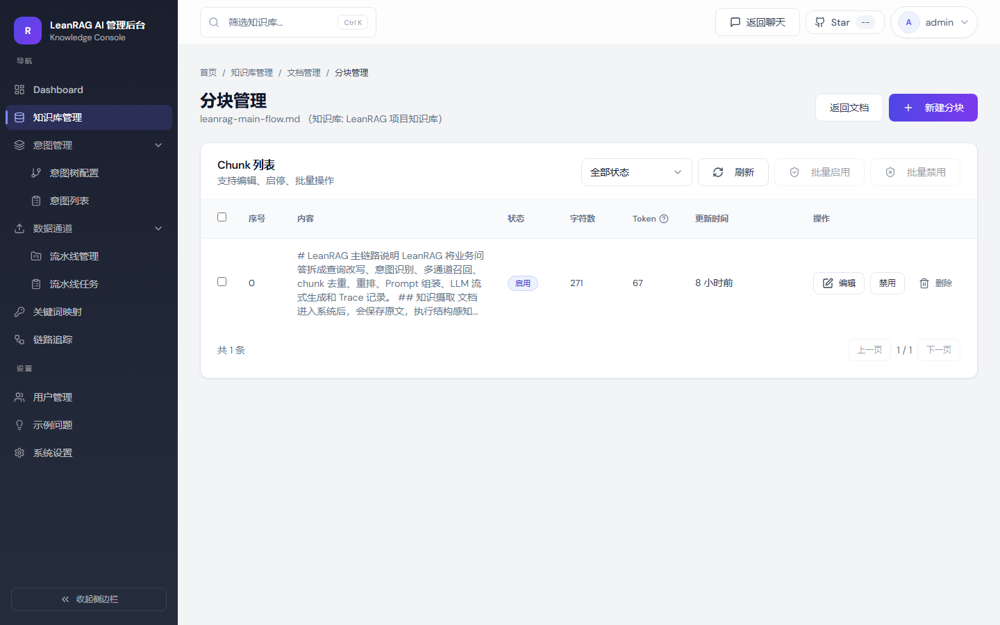
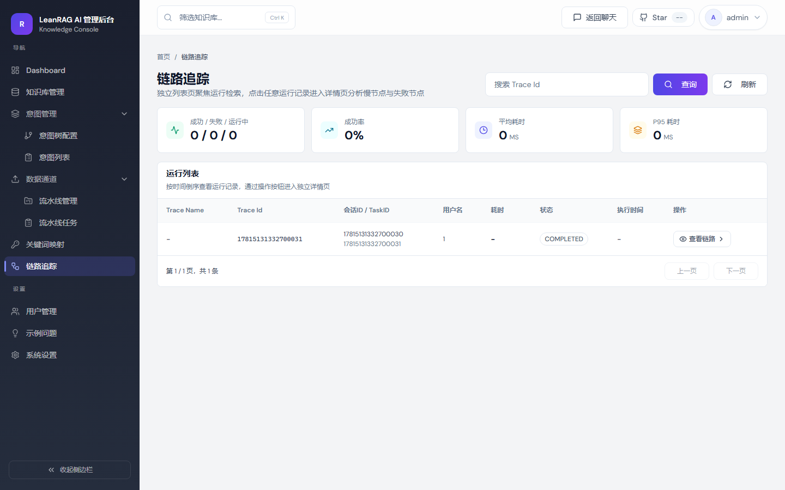

# LeanRAG

LeanRAG 是一个面向业务问答场景的轻量级 RAG 应用。当前项目由 FastAPI 后端、React/Vite 前端和一个示例 MCP 工具服务组成，重点展示从知识接入、文本切分、检索、意图识别、MCP 工具调用、Prompt 编排、SSE 流式回答到 RAG Trace 观测的完整工程链路。

项目当前内置了电商客服 demo 数据，适合用来演示“知识库 + 结构化业务工具”的混合问答：例如退货退款规则、发货配送、发票、商品服务、支付优惠，以及具体订单的物流、退款、履约和地址修改查询。

## 当前能力

- 聊天问答：`/api/ragent/rag/v3/chat` 通过 SSE 返回流式回答，支持停止任务、会话列表、消息历史和反馈。
- 知识库管理：支持创建知识库、上传文件或 URL、文档预览、chunk 生成、chunk 启停和批量启停。
- RAG 编排：包含会话记忆、问题改写与拆分、意图识别、多通道召回、去重、rerank、Prompt 渲染和回答生成。
- MCP 工具融合：可按意图调用示例 MCP 服务，并把工具结果与知识库片段一起交给回答层。
- 可观测性：记录 guardrail、rewrite、intent、retrieve、prompt、decision、LLM 等 trace 节点，后台可查看 evidence 和决策结果。
- 评估与健康检查：提供 RAG eval 状态接口和模型 Provider 健康检查接口，方便在后台确认运行状态。
- 后台运营：包含仪表盘、用户管理、知识库、摄取任务、意图树、词条映射、示例问题、系统设置和 trace 页面。
- 本地 fallback：数据库、模型、向量检索、rerank、消息队列等外部依赖不可用时，核心流程仍可用内存或确定性 fallback 跑通。

## 界面预览

### 聊天主流程



### 知识库文档管理



### Chunk 管理



### RAG 链路追踪



## 技术栈

后端：

- Python 3.11+
- FastAPI
- SQLAlchemy
- Pydantic
- httpx
- pytest

前端：

- React 18
- TypeScript
- Vite
- Tailwind CSS
- Radix UI
- Zustand
- React Router
- Recharts

AI 与基础设施适配：

- OpenAI-style Chat Completion / Embedding API
- Ollama、百炼、AIHubMix、SiliconFlow
- PostgreSQL / pgvector 风格检索 fallback
- Milvus 适配
- S3 兼容对象存储适配
- Redis / RocketMQ 风格状态与消息适配
- MCP 兼容工具服务

## 快速启动

以下命令以 PowerShell 为例。

### 1. 安装后端依赖

```powershell
python -m venv .venv
.\.venv\Scripts\Activate.ps1
python -m pip install -e ".[dev]"
```

### 2. 安装前端依赖

项目同时存在 `pnpm-lock.yaml` 和 `package-lock.json`。新增或重装前端依赖时优先使用 pnpm。

```powershell
cd frontend
pnpm install
```

如果本机没有 pnpm，也可以临时使用：

```powershell
npm install
```

### 3. 准备环境变量

```powershell
Copy-Item .env.example .env
```

默认配置会尝试连接本地 PostgreSQL、Redis、Milvus、对象存储和 MCP 服务，但这些依赖不可用时，仓储层和模型层会回退到本地 fallback。最快体验可以先不启动外部数据库和真实模型。

常用配置：

```env
RAGENT_CONTEXT_PATH=/api/ragent
RAGENT_PORT=9090
MCP_SERVER_URL=http://localhost:9099
RAGENT_CHAT_PROVIDER=
RAGENT_EMBEDDING_PROVIDER=
RAGENT_RERANK_PROVIDER=
```

配置真实模型时可选择：

- `RAGENT_CHAT_PROVIDER=ollama|bailian|aihubmix|siliconflow`
- `RAGENT_EMBEDDING_PROVIDER=ollama|aihubmix|siliconflow`
- `RAGENT_RERANK_PROVIDER=bailian`

对应 API Key 和模型名见 [.env.example](.env.example)。

### 4. 启动后端 API

```powershell
python -m uvicorn app.main:app --host 0.0.0.0 --port 9090 --reload
```

API 默认挂载在：

```text
http://localhost:9090/api/ragent
```

### 5. 启动 MCP demo 服务

另开一个终端：

```powershell
python -m uvicorn mcp_server.main:app --host 0.0.0.0 --port 9099 --reload
```

可用工具包括：

- `weather_query`
- `ticket_query`
- `sales_query`
- `order_query`

### 6. 启动前端

```powershell
cd frontend
pnpm dev
```

前端默认运行在：

```text
http://localhost:5173
```

Vite 已将 `/api` 代理到 `http://localhost:9090`。

## 登录

内存 fallback 模式内置默认管理员：

```text
username: admin
password: admin
```

如果配置了真实数据库，则登录账号来自数据库表；数据库不可用或查询失败时会自动回退到内存账号。

## 电商客服 Demo

电商客服意图树对应的知识库种子文件位于：

```text
resources/demo/ecommerce/
```

其中 `kb-ecommerce-*.md` 对应知识库检索意图，`order-query-*.md` 对应订单 MCP 路由的回答口径和槽位说明，`orders.json` 是 MCP demo 服务读取的订单样例数据。

主要样例：

- `kb-ecommerce-refund-policy.md`
- `kb-ecommerce-shipping-policy.md`
- `kb-ecommerce-invoice-policy.md`
- `kb-ecommerce-product-service.md`
- `kb-ecommerce-payment-promotion.md`
- `order-query-logistics.md`
- `order-query-refund-status.md`
- `order-query-fulfillment.md`
- `order-query-address-change.md`
- `orders.json`

推荐演示问题：

```text
退货规则是什么？
多久发货？包邮吗？
发票抬头填错了还能改吗？
这个商品保修多久？
优惠券可以和满减一起用吗？
我的订单 EC202606260001 到哪了？
订单 EC202606260002 的退款进度怎么样？
订单 EC202606260003 还能改地址吗？
```

更多电商订单数据结构说明见 [docs/ecommerce-order-schema.md](docs/ecommerce-order-schema.md)，知识库种子文件说明见 [resources/demo/ecommerce/README.md](resources/demo/ecommerce/README.md)。

`weather_query`、`ticket_query`、`sales_query` 也保留在 MCP demo 服务中，用于演示非订单类结构化工具调用。

## 架构概览

```text
React + Vite 前端
        |
        v
FastAPI API 服务
        |
        +-- Auth / User / Conversation
        +-- Chat SSE
        +-- Knowledge Base / Document / Chunk
        +-- Ingestion Pipeline / Task
        +-- RAG Admin / Trace / Model Health
        |
        v
RAG Pipeline
        |
        +-- Conversation Memory
        +-- Query Rewrite
        +-- Intent Resolver
        +-- Retrieval Engine
        +-- MCP Tool Call
        +-- Prompt Builder
        +-- LLM Client
        +-- Trace Recorder
        |
        v
Repository
        |
        +-- SQLAlchemy / PostgreSQL when available
        +-- In-memory fallback when unavailable
```

## 核心链路

聊天请求的大致流程：

```text
用户问题
  -> guardrail 检查
  -> 会话创建和用户消息入库
  -> 加载会话记忆
  -> 查询改写和子问题拆分
  -> 意图识别
  -> 歧义澄清或系统意图处理
  -> 知识库召回 / MCP 工具调用
  -> evidence 和上下文组装
  -> Prompt 渲染
  -> LLM 流式生成
  -> 助手消息入库
  -> RAG Trace 记录
```

### 电商客服意图树与路由

当前默认意图树面向电商客服先分为三条一级路由：

| 一级意图 | kind | 说明 | 后续路由 |
| --- | --- | --- | --- |
| `chat.general` | `system` | 闲聊、问候、感谢、身份询问、结束语等，不需要业务检索。 | 直接进入系统聊天 Prompt，不做知识库召回，不调用 MCP 工具。 |
| `kb.ecommerce` | `kb` | 电商规则、政策、商品服务说明、售后流程等知识型问题。 | 进入 RAG 检索，按命中的子意图做知识库召回，再组装 KB Prompt 回答。 |
| `order.query` | `mcp` | 需要查询用户具体订单、物流、退款、售后进度、地址等结构化业务数据的问题。 | 调用 MCP 工具 `order_query`，工具结果进入回答上下文。 |

`kb.ecommerce` 下的知识库子意图：

| 子意图 | 描述 | 典型表达 | 后续路由 |
| --- | --- | --- | --- |
| `kb.ecommerce.refund_policy` | 退货、换货、仅退款、退货退款、七天无理由、退款时效、售后条件等规则。 | “退货规则是什么？”、“支持七天无理由吗？”、“退款多久到账？” | 知识库召回，使用 KB 回答模板。 |
| `kb.ecommerce.shipping_policy` | 发货时效、配送范围、快递方式、运费、包邮门槛、物流异常规则。 | “多久发货？”、“包邮吗？”、“物流异常怎么办？” | 知识库召回，回答平台规则或处理说明。 |
| `kb.ecommerce.invoice_policy` | 电子发票、纸质发票、发票抬头、开票时间、补开发票、发票修改。 | “发票怎么开？”、“能补开发票吗？”、“发票抬头怎么改？” | 知识库召回，回答发票规则。 |
| `kb.ecommerce.product_service` | 商品规格、尺码、保修、安装、赠品、库存、适用场景、服务承诺。 | “这个商品保修多久？”、“尺码怎么选？”、“有没有赠品？” | 知识库召回，回答商品或服务说明。 |
| `kb.ecommerce.payment_promotion` | 支付方式、优惠券、满减、积分、会员权益、活动规则、价格保护。 | “优惠券怎么用？”、“会员权益有哪些？”、“保价规则是什么？” | 知识库召回，回答支付和营销规则。 |

`order.query` 下的订单查询子意图：

| 子意图 | 描述 | 典型表达 | MCP 参数路由 |
| --- | --- | --- | --- |
| `order.query.logistics` | 查询具体订单物流轨迹、快递单号、预计送达、签收状态、配送异常。 | “我的订单到哪了？”、“快递单号是多少？”、“什么时候送到？” | `order_query`，`queryType=logistics` |
| `order.query.refund_status` | 查询具体订单退款进度、退货退款状态、售后审核结果、平台介入进度。 | “我的退款进度到哪了？”、“售后审核通过了吗？” | `order_query`，`queryType=refund` |
| `order.query.fulfillment` | 查询订单是否付款、是否发货、发货延迟原因、订单取消、订单明细状态。 | “订单为什么还没发货？”、“订单状态是什么？”、“付款成功了吗？” | `order_query`，`queryType=fulfillment` |
| `order.query.address_change` | 查询具体订单是否还能修改收货地址、联系电话或配送信息。 | “这个订单能不能改地址？”、“地址填错了怎么办？” | `order_query`，`queryType=address` |

边界判断：

- “退货规则是什么？” 属于 `kb.ecommerce.refund_policy`，因为用户问的是规则。
- “我的退款进度到哪了？” 属于 `order.query.refund_status`，因为需要查询具体订单状态。
- “物流异常怎么办？” 属于 `kb.ecommerce.shipping_policy`，因为用户问处理规则。
- “我的快递到哪里了？” 属于 `order.query.logistics`，因为需要查询具体物流数据。

如果一句话同时包含知识库问题和订单问题，查询改写会先拆成子问题，意图识别分别输出 `kb` 和 `mcp` 节点。检索层会同时执行知识库召回和 MCP 工具调用，最后用 mixed 场景 Prompt 合并回答。

知识摄取的大致流程：

```text
文件或 URL
  -> 原始内容读取
  -> 文本解码
  -> fixed_size / paragraph / structure_aware 切分
  -> embedding 生成
  -> 向量写入或内存 fallback
  -> 文档、chunk、日志可在后台查看
```

## 目录结构

```text
app/
  api/          认证、聊天、知识库、摄取、RAG 管理、仪表盘 API
  core/         配置、认证、响应封装、错误处理、ID 生成
  db/           SQLAlchemy 模型、会话和仓储
  infra/        LLM、embedding、rerank、Milvus、对象存储、消息、任务状态适配
  ingestion/    摄取流水线
  knowledge/    知识文档摄取服务
  rag/          改写、意图、检索、Prompt、记忆、可靠性、标题生成和聊天编排
  services/     内存 fallback store

frontend/
  src/          React 页面、组件、hooks、stores、API services 和路由

mcp_server/     示例 MCP 工具服务
resources/      Prompt 模板和电商客服 demo 数据
docs/           设计文档、订单模型说明和截图
tests/          API、RAG、MCP、管理接口、fallback 和电商场景测试
```

## 测试与验证

后端测试：

```powershell
pytest
```

前端构建：

```powershell
cd frontend
pnpm build
```

当前 `frontend/package.json` 尚未配置独立的 `test` 脚本。修改前端代码后至少运行构建；如果后续补充测试脚本，再按项目约定执行对应测试命令。本文档更新只涉及 Markdown，不需要运行前端测试。

## API 入口

主要路由均挂在 `RAGENT_CONTEXT_PATH` 下，默认是 `/api/ragent`。

常用接口：

- `POST /auth/login`
- `GET /user/me`
- `GET /rag/v3/chat`
- `POST /rag/v3/stop`
- `GET /conversations`
- `GET /knowledge-base`
- `POST /knowledge-base`
- `POST /knowledge-base/{kb_id}/docs/upload`
- `GET /ingestion/pipelines`
- `GET /ingestion/tasks`
- `GET /rag/traces/runs`
- `GET /rag/model-health`
- `GET /rag/eval`

## 当前边界

LeanRAG 当前更偏工程样例和本地可演示版本，不是开箱即用的生产部署包。生产化时建议补齐：

- 数据库迁移和初始化脚本
- 密码哈希、权限模型、审计和限流
- 稳定的 PostgreSQL / pgvector 或 Milvus 部署
- 持久化对象存储和消息队列
- 模型 Provider 凭证管理和调用监控
- 后台数据导入脚本
- 更完整的前端单元测试和端到端测试

项目的核心价值在于 RAG 工程链路已经拆成清晰模块，外部基础设施可以通过适配层逐步替换和增强。
